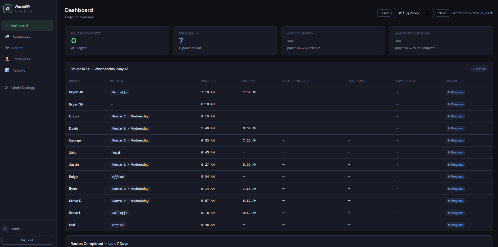
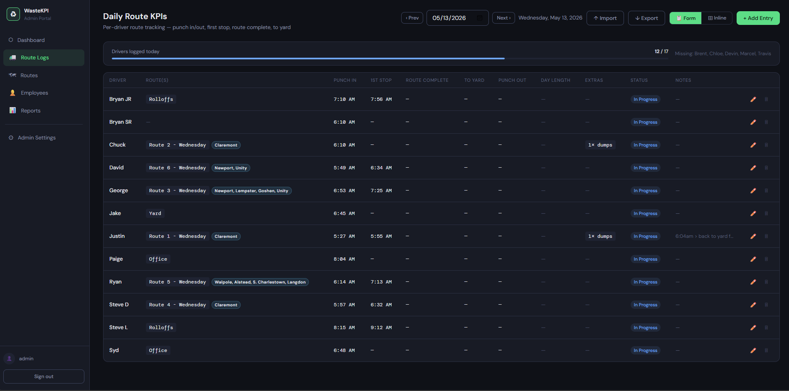
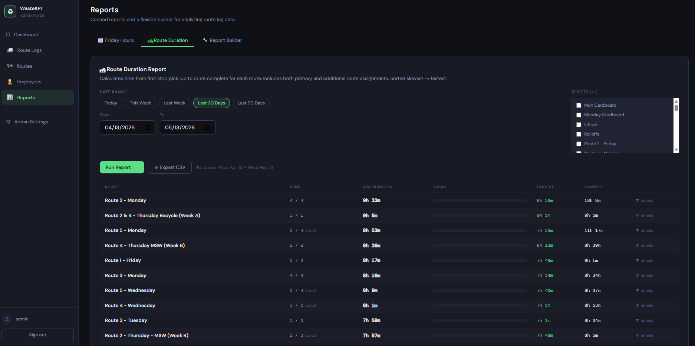
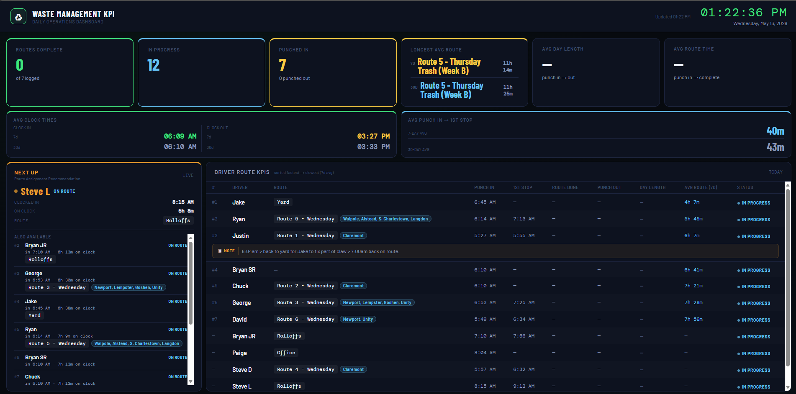
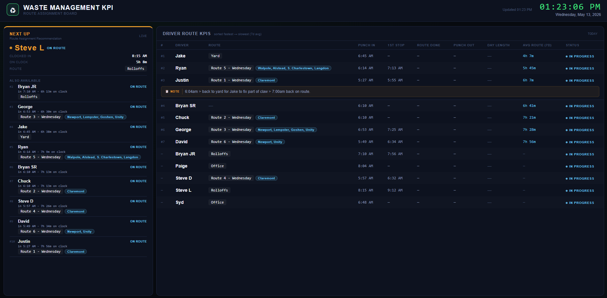

# Waste Management KPI Tracker

A self-hosted, Docker-based operations dashboard for small waste management companies. Tracks daily driver KPIs — punch in/out times, route completion, first stop, to-yard time, pack-out (dump) events, and multiple route assignments per driver — and displays live metrics on read-only TV display boards.


---

## Screenshots

### Admin Dashboard


### Route Log Entry — Inline Mode


### Route Duration Report


### Full Display Board


### Slim Display Board


---

## Features

### Admin Portal (`/admin/`)
- **Daily Route Log entry** — Form mode (modal) or Excel-style inline editing with custom time picker
- **Multiple route assignments** — Drivers can be assigned to or help with additional routes in the same day; each additional route tracks its own 1st stop and route complete time
- **Pack-out event tracking** — Multiple dump runs per driver per day with location (Alva / Naughton / Casella)
- **To Yard time** — Track when each driver departs for the yard at end of day
- **Driver & Route management** — Active/inactive, area tagging, route exclusion from analytics
- **Driver ID** — Internal identifier per driver (admin-only, not exposed to regular users)
- **Exclude from Next Up** — Per-driver flag to remove a driver from the Route Assignment Recommendation calculation
- **Reports** — Friday Hours, Route Duration, and custom report builder — all with CSV export
- **CSV Import / Export** — Bulk data entry with pack-out column support
- **Backup & Restore** — Full JSON snapshot download + restore + data erase
- **User Management** — Per-user logins with Admin/User role separation
- **Auto-migrations** — Database schema migrations run automatically on startup
- **Write-Ahead Log** — Crash-safe intent log ensures in-flight saves survive API container restarts

### Display Boards
- **Full board** (`/display/`) — Stat tiles, insight cards, Next Up recommendation, Driver KPI table
- **Slim board** (`/slimdisplay/`) — Next Up + Driver KPI table only, ideal for smaller screens or a dedicated assignment monitor
- Read-only, no login required, auto-refreshes every 60 seconds
- Excluded routes and Next Up-excluded drivers are filtered correctly

### API (`/api/`)
- JWT-authenticated REST API
- Full CRUD for all entities
- Role-based access control (admin vs user)
- Reports endpoints: Friday Hours, Route Duration, Custom Builder

---

## Tech Stack

| Layer | Technology |
|---|---|
| Reverse proxy | Nginx (Alpine) |
| Frontend (Admin) | React 18 + Vite |
| Frontend (Display) | React 18 + Vite |
| Frontend (Slim Display) | React 18 + Vite |
| API | Node.js 20 + Express |
| Database | PostgreSQL 16 |
| Auth | JWT (bcryptjs) |
| Container | Docker Compose |

---

## Quick Start

### 1. Clone and configure

```bash
git clone https://github.com/YOUR_USERNAME/waste-kpi.git
cd waste-kpi
cp .env.example .env
```

Edit `.env` and set:
- `POSTGRES_PASSWORD` — a strong database password
- `JWT_SECRET` — a random string, minimum 32 characters
- `ADMIN_PASSWORD` — initial admin account password
- `REAL_HOST` — your hostname or `localhost:3300` for local use

### 2. Build and start

```bash
docker compose build
docker compose up -d
```

Migrations run automatically on first startup. No manual SQL needed.

### 3. Access

| URL | Description |
|---|---|
| `http://localhost:3300/admin/` | Admin portal (default: admin / admin123) |
| `http://localhost:3300/display/` | Full display board |
| `http://localhost:3300/slimdisplay/` | Slim display board (Next Up + KPIs only) |

> **Change the default admin password immediately** after first login via Admin Settings → Users.

---

## Upstream Proxy (Nginx Proxy Manager, Traefik, etc.)

If running behind NPM or another proxy, add these headers in the Advanced tab:

```nginx
proxy_set_header Host $host;
proxy_set_header X-Real-IP $remote_addr;
proxy_set_header X-Forwarded-For $proxy_add_x_forwarded_for;
proxy_set_header X-Forwarded-Proto $scheme;
proxy_set_header Upgrade $http_upgrade;
proxy_set_header Connection "upgrade";
proxy_http_version 1.1;
```

---

## Documentation

See the [`docs/`](docs/) folder:

- [`docs/ARCHITECTURE.md`](docs/ARCHITECTURE.md) — System design, container layout, data flow
- [`docs/API.md`](docs/API.md) — Full API reference
- [`docs/SETUP.md`](docs/SETUP.md) — Detailed installation and configuration guide
- [`docs/USER_GUIDE.md`](docs/USER_GUIDE.md) — How to use the admin portal and display boards
- [`docs/DEVELOPMENT.md`](docs/DEVELOPMENT.md) — Local development setup, project structure

---

## Project Structure

```
waste-kpi/
├── api/
│   ├── src/
│   │   ├── db/
│   │   │   ├── schema.sql
│   │   │   ├── migrate.js
│   │   │   ├── 001_add_packout_table.sql
│   │   │   ├── 002_v1_1_new_columns.sql
│   │   │   ├── 003_add_driver_id.sql
│   │   │   ├── 004_add_exclude_from_next_up.sql
│   │   │   └── 005_add_additional_routes.sql
│   │   ├── middleware/auth.js
│   │   ├── routes/
│   │   │   ├── auth.js, employees.js, routes.js
│   │   │   ├── routeLogs.js, packOuts.js, clockLogs.js
│   │   │   ├── dashboard.js, import.js, backup.js
│   │   │   ├── users.js, reports.js
│   │   ├── wal.js                  ← Write-Ahead Log
│   │   └── index.js
│   └── Dockerfile
├── admin-ui/
│   ├── src/
│   │   ├── components/
│   │   │   └── Layout.jsx, Modal.jsx, Toast.jsx,
│   │   │       DateNav.jsx, TimePicker.jsx,
│   │   │       ExportModal.jsx, ImportModal.jsx
│   │   ├── pages/
│   │   │   └── Login.jsx, Dashboard.jsx, RouteLogs.jsx,
│   │   │       RoutesMgmt.jsx, EmployeesMgmt.jsx,
│   │   │       Reports.jsx, Admin.jsx
│   │   ├── api.js
│   │   └── App.jsx
│   └── Dockerfile
├── display-ui/src/App.jsx          ← Full display board
├── slim-display-ui/src/App.jsx     ← Slim display board
├── nginx/nginx.conf.template, entrypoint.sh
├── docs/
│   ├── screenshots/                ← dashboard, route-logs, reports, display boards
│   └── ARCHITECTURE.md, API.md, SETUP.md, USER_GUIDE.md, DEVELOPMENT.md
├── docker-compose.yml
├── .env.example
└── README.md
```

---

## Updating

```bash
git pull
docker compose build --no-cache
docker compose up -d
```

Migrations run automatically — no manual database steps needed.

---

## License

MIT — see [LICENSE](LICENSE)
